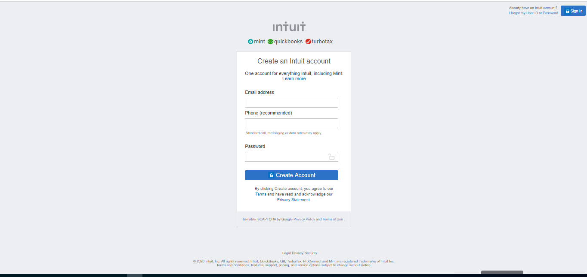

# mint-signup-page (Embedding Images and Video)

> Microverse Collaborative Project (Stanley and Umair)

Additional description about the project and its features.

## Built With

- HTML,
- CSS,

## Live Demo

[Live Demo Link](https://happiguru.github.io/Youtube_Home_Page/)
<!-- [Live Demo Link - Umair](https://umairarshadbutt.github.io/Youtube_Home_Page/) -->

## Getting Started

**Navigation bar**
- Go to [Mint.com’s signup page](https://mint.intuit.com/login.event?task=S) and have a look around. The form isn’t exceptionally complicated.

To get a local copy up and running follow these simple example steps.

### Prerequisites

- Browser
- Internet

## Authors

👤 **Stanley Enow Lekunze**

- Github: [@happiguru](https://github.com/happiguru)
- Twitter: [@Lekunze_Nley](https://twitter.com/Lekunze_Nley)
- Linkedin: [lekunze-nley](https://www.linkedin.com/in/lekunze-nley/)

👤 **Umair Arshad**

- Github: [@umairarshadbutt](https://github.com/umairarshadbutt)
- Twitter: [@its_UmairArshad](https://twitter.com/its_UmairArshad)
- Linkedin: [umair-arshad-butt](https://www.linkedin.com/in/umair-arshad-butt/)

## Show your support

Give a ⭐️ if you like this project!

## Acknowledgments

- Hat tip to anyone whose code was used
- Inspiration
- etc

## 📝 License

This project is [MIT](LICENSE) licensed.